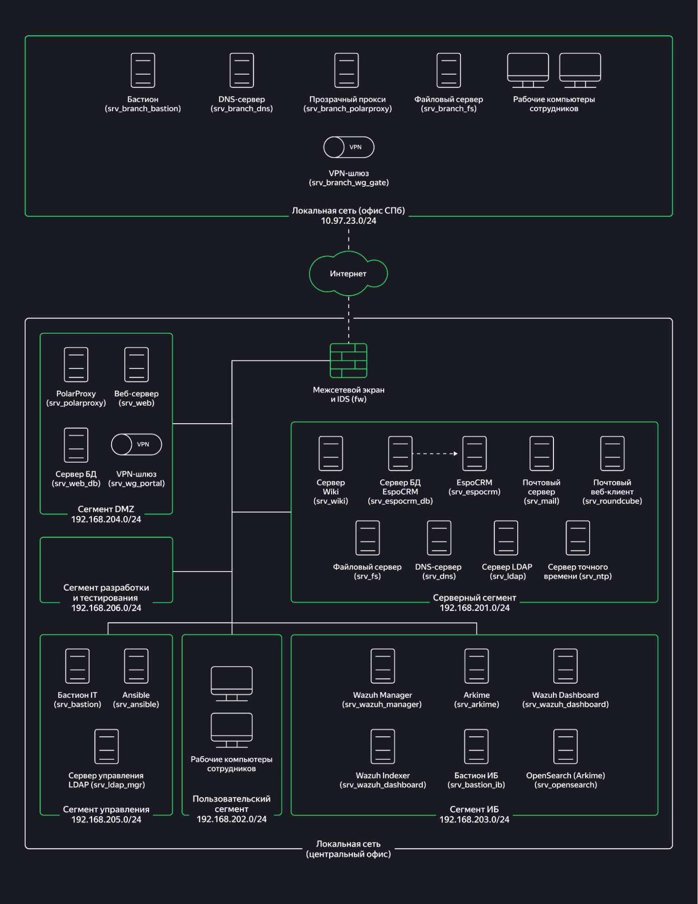
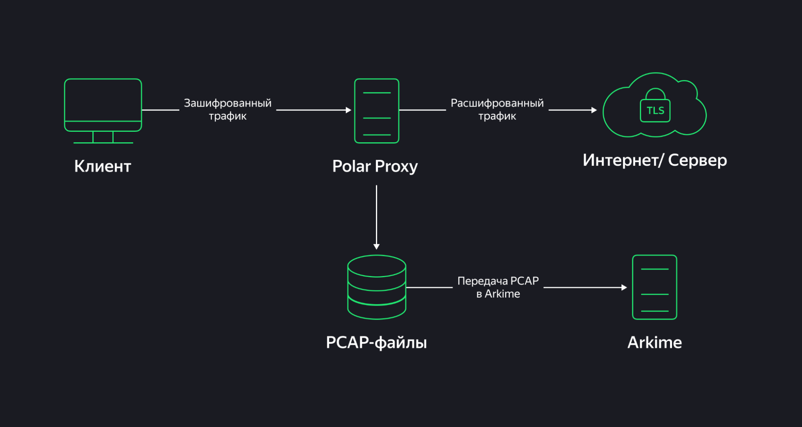

# Secure Infrastructure Thesis

Дипломный проект по аудиту, проектированию и внедрению мер защиты для инфраструктуры головного офиса и филиала компании Local Host Development.

Проект выполнен в рамках профессиональной переподготовки по программе «Специалист по информационной безопасности» в Яндекс Практикуме.

> Все работы выполнены исключительно в изолированной учебной лабораторной среде на виртуальных машинах и контейнерах. В публичной версии репозитория не публикуются реальные учётные данные, пароли, токены, ключи WireGuard, персональные данные, данные CRM, дампы трафика и другие конфиденциальные сведения.

## Цель дипломного проекта

Провести аудит защищённости инфраструктуры компании, выявить системные проблемы в информационной безопасности, доработать внутренние стандарты и реализовать технические меры защиты для центрального офиса, филиала и тестовой Windows-инфраструктуры.

## Задачи

- Провести аудит инфраструктуры и проверить выполнение требований по управлению доступом, учётными записями, регистрации событий и антивирусной защите.
- Исследовать инциденты и выявить их корневые причины.
- Выявить системные проблемы в информационной безопасности и подготовить план их устранения.
- Доработать политику управления учётными записями и доступом к ресурсам.
- Доработать инструкцию по безопасной настройке Linux и расширить её требованиями для Windows и Active Directory.
- Выполнить Linux hardening на рабочих станциях центрального офиса.
- Настроить парольные политики и блокировку учётных записей в OpenLDAP.
- Выполнить сегментацию сети филиала и настроить фильтрацию трафика через `nftables` по принципу `default deny`.
- Развернуть и автоматизировать ClamAV с Ansible.
- Настроить тестовый домен Active Directory, структуру OU, группы, пользователей и групповые политики GPO.
- Проверить выполненные настройки автоматизированными сценариями Ansible и зафиксировать результаты.

## Контекст и архитектура

Инфраструктура включает центральный офис и филиал в Санкт-Петербурге, связанные через Интернет и защищённые VPN-шлюзы.

В центральном офисе выделены сегменты:

| Сегмент | Назначение |
|---|---|
| DMZ | Публичные сервисы: веб-сервер, веб-БД, VPN-шлюз и прозрачный прокси |
| Серверный сегмент | Внутренние сервисы: Wiki, CRM, БД CRM, почта, Samba, DNS, LDAP и NTP |
| Пользовательский сегмент | Рабочие станции сотрудников |
| Сегмент управления | Бастион-хост, Ansible и инструменты администрирования LDAP |
| Сегмент ИБ | Wazuh Manager, Wazuh Indexer, Wazuh Dashboard, Arkime, OpenSearch и бастион ИБ |
| Сегмент разработки и тестирования | Изолированная среда для задач разработки и тестирования |

В филиале выделены рабочие станции, файловый сервер, DNS-сервер, bastion host, VPN-шлюз и прозрачный прокси PolarProxy.



## Мониторинг сетевого трафика

Для контролируемого анализа HTTPS-трафика в учебной среде использовался прозрачный прокси PolarProxy с передачей PCAP-данных в Arkime.

Поток обработки данных:

1. Клиент устанавливает защищённое TLS-соединение.
2. PolarProxy выполняет контролируемую расшифровку трафика в учебной среде.
3. Сформированные PCAP-файлы передаются в Arkime.
4. Arkime индексирует и предоставляет данные для анализа сетевых событий.



> Анализ HTTPS-трафика выполнялся исключительно в авторизованной учебной среде. В репозиторий не загружаются PCAP-файлы, сертификаты, приватные ключи, журналы сессий или персональные данные.

## Технологии

### ОС, инфраструктура и автоматизация

- Linux: Ubuntu, Debian
- Windows Server
- Docker и Docker Compose
- Ansible
- Bash, PowerShell, YAML
- Git и GitHub

### Идентификация и управление доступом

- OpenLDAP
- SSSD, PAM, NSS
- LDAP password policy (ppolicy)
- Active Directory
- Organizational Units (OU)
- Group Policy Objects (GPO)
- Role-Based Access Control (RBAC)
- POSIX ACL
- Samba/SMB

### Сети и защита периметра

- TCP/IP, DNS, DMZ
- Сегментация сети
- nftables
- Принцип `default deny`
- VPN
- Bastion hosts
- PolarProxy
- Arkime

### Мониторинг и защита

- Wazuh Manager, Indexer и Dashboard
- OpenSearch
- rsyslog и logrotate
- ClamAV
- EICAR test file
- Анализ журналов событий

## Выполненные работы

### Аудит и анализ системных проблем

В первой части дипломного проекта проведён аудит инфраструктуры и проверка выполнения требований по:

- Управлению доступом и разграничению привилегий.
- Управлению учётными записями.
- Регистрации событий безопасности.
- Антивирусной защите.

По итогам аудита и расследований выявлены проблемы, связанные с избыточными полномочиями, небезопасными настройками `sudo`, отсутствием или неполнотой парольных политик, недостаточной сегментацией, недостаточным контролем сетевых потоков, настройками журналирования и отсутствием централизованного подхода к антивирусной защите.

Подготовлены:

- Чек-лист аудита и фиксация выявленных несоответствий.
- Анализ корневых причин проблем и инцидентов.
- Перечень системных проблем и варианты их устранения.
- Оперативный и среднесрочный план повышения защищённости.
- Предложения по доработке корпоративных стандартов.

### Linux hardening и OpenLDAP

Для рабочих станций Linux центрального офиса подготовлен и применён baseline безопасной конфигурации.

Реализованы меры:

- Ограничение прямого доступа root и настройка безопасного SSH.
- Настройка SSSD, PAM и NSS для работы с централизованным каталогом OpenLDAP.
- Парольная политика: минимальная длина 8 символов, требования к сложности, запрет повторного использования последних 3 паролей, максимальный срок действия 180 дней.
- Блокировка учётной записи после 5 неудачных попыток аутентификации.
- Ограничение административных полномочий и исключение небезопасных правил `NOPASSWD`.
- Управление доступом через группы LDAP и PAM access control.
- Настройка журналирования `rsyslog`, прав доступа к журналам и ротации логов с `logrotate`.
- Настройка LDAP ppolicy для пользователей и сервисных учётных записей.
- Автоматизированная проверка конфигураций через Ansible.

### Сегментация филиала и nftables

Для филиала в Санкт-Петербурге разработана и применена целевая схема сегментации.

Выделены сети для:

- Пользовательских устройств.
- Серверов.
- Управления.
- DMZ.
- Внешнего подключения.

Выполненные меры:

- Перераспределение хостов филиала по целевым сегментам в Docker-стенде.
- Настройка шлюзов и DNS-параметров для каждого сегмента.
- Подготовка карты сетевых потоков.
- Настройка `nftables` на межсетевом экране филиала.
- Применение политик `default deny` для неразрешённого трафика.
- Разрешение только документированных соединений, необходимых для DNS, LDAP, SMB, SSH, Ansible, NTP, почтовых сервисов и контролируемого доступа к Интернету через прокси.
- Проверка доступности критичных сервисов после сегментации.

### Антивирусная защита ClamAV

Для пользовательских хостов центрального офиса и файлового сервера создан Ansible-сценарий автоматизированного развёртывания ClamAV.

Сценарий обеспечивает:

- Установку пакетов ClamAV при их отсутствии.
- Создание каталога журналов `/var/log/clamav`.
- Проверку и обновление антивирусных баз.
- Создание сценария полного сканирования файловой системы.
- Настройку ежедневного запуска проверки через планировщик.
- Централизованное применение настроек на пользовательских хостах и файловом сервере.
- Контролируемую проверку детектирования EICAR.
- Автоматизированную валидацию конфигурации через Ansible.

### Active Directory и GPO

Развёрнут тестовый домен Active Directory:

```text
int.local.host
```

В тестовой Windows-инфраструктуре реализованы:

- Структура OU: `Disabled Accounts`, `Groups`, `ADMIN`, `INFRA`, `ORG`, `RES`, `Users`, `Service Accounts`.
- Пользовательские и групповые объекты, связанные с IT-подразделением.
- Ролевая модель доступа с административными, инфраструктурными, организационными и ресурсными группами.
- Ввод второй Windows Server в домен.
- Политика минимальной длины и сложности паролей.
- Ограничение срока действия пароля и истории паролей.
- Блокировка учётной записи после 5 неудачных попыток входа.
- Отключение гостевой учётной записи.
- Ограничение интерактивного входа локальных пользователей.
- Разрешение RDP только группам `Domain Admins` и `RDP_Users`.
- Настройка аудита входов, управления учётными записями, изменений политик, привилегий и доступа к выбранной файловой папке.
- Проверка применения доменных политик на втором сервере.

### Корпоративные стандарты

По результатам аудита были доработаны корпоративные документы:

- Политика управления учётными записями и доступом к ресурсам.
- Инструкция по настройке безопасности ОС Linux и Windows.

В стандартах закреплены требования к:

- Управлению учётными записями и жизненному циклу доступа.
- Парольной политике и блокировке учётных записей.
- Ролевому разграничению доступа.
- Настройке `sudo`, PAM, SSSD и SSH.
- Журналированию и хранению событий.
- Сегментации сети и контролю сетевых потоков.
- Антивирусной защите.
- Требованиям для Windows и Active Directory.

## Проверка результатов

Выполненные настройки проверялись с помощью:

- Ansible-сценария `test_p.yaml` для Linux hardening и политик.
- Ansible-сценария `test_a.yaml` для проверки антивирусной защиты.
- Проверки применения LDAP ppolicy.
- Проверки групп, прав доступа и аутентификации в OpenLDAP.
- Проверки межсегментной связности и правил `nftables`.
- Проверки доступности корпоративных сервисов филиала.
- Проверки ClamAV на тестовом файле EICAR.
- Проверки применения GPO на доменном Windows Server.
- Анализа журналов и сетевых событий в Wazuh и Arkime.

## Артефакты проекта

### Аудит и реализация мер защиты

- [Отчёт по аудиту инфраструктуры и расследованию инцидентов — часть 1](ThesisPart1AuditReport.docx)
- [Чек-лист аудита и оценки соответствия требованиям](ThesisAuditChecklist.xlsx)
- [Отчёт по устранению системных проблем и внедрению мер защиты — часть 2](ThesisPart2ImplementationReport.docx)

### Проверка автоматизации

- [Результат проверки Ansible: Linux hardening и политики](LinuxHardeningAnsibleValidation.log)
- [Результат проверки Ansible: антивирусная защита ClamAV](ClamAVAnsibleValidation.log)

### Корпоративные стандарты

- [Инструкция по настройке безопасности ОС Linux и Windows](LinuxWindowsSecurityBaseline.docx)
- [Политика управления учётными записями и доступом к ресурсам](AccessManagementPolicy.docx)

### Схемы

- [Схема инфраструктуры головного офиса и филиала](thesis-network-architecture.jpg)
- [Схема обработки HTTPS-трафика через PolarProxy и Arkime](polarproxy-arkime-flow.jpg)

> Все материалы подготовлены и успешно проверены в рамках дипломного проекта Яндекс Практикума. Работа выполнялась исключительно в изолированной виртуальной лабораторной среде.

## Безопасность публикации

- Все работы выполнены только в учебной виртуальной среде.
- В репозиторий не загружаются реальные персональные данные, данные CRM, учётные данные, токены, пароли, приватные ключи и VPN-конфигурации.
- Не публикуются PCAP-файлы, TLS-сертификаты, приватные ключи и журналы сессий.
- Конфигурации и скриншоты проходят обезличивание перед публикацией.
- Материалы приведены в образовательных целях и не предназначены для несанкционированного доступа к чужим системам.

## Автор

Владимир Бурдин  
Специалист по информационной безопасности

- GitHub: [@vladimirbr-rgb](https://github.com/vladimirbr-rgb)
- HH.ru: [резюме](https://hh.ru/resume/f0a4ab52ff111561650039ed1f56506a4b797a)
- Telegram: [@VIBVID](https://t.me/VIBVID)
